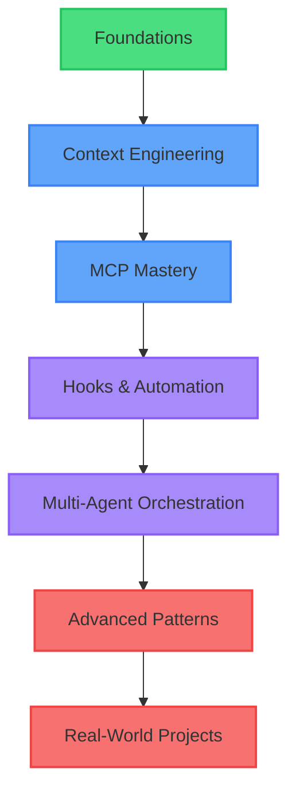
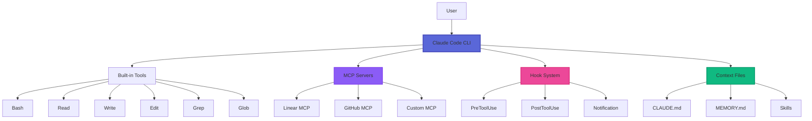
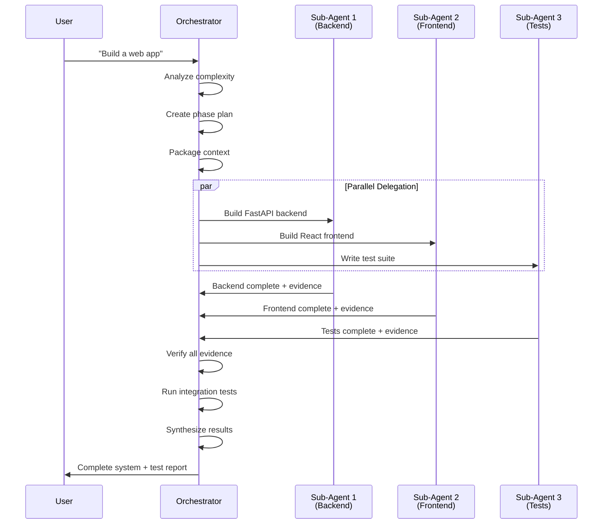
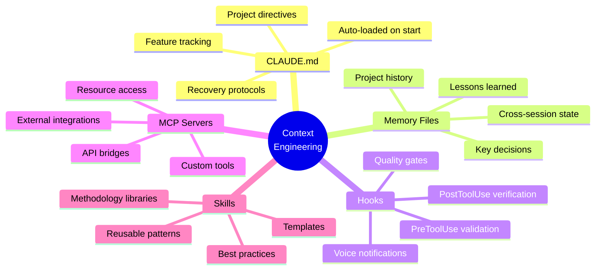

# BACON-AI Claude Mastery

### The Definitive Training Platform for Mastering Claude Code CLI

*Battle-tested across 20+ production projects | From fundamentals to advanced multi-agent orchestration*

---

> **Warning**
> This project is currently in **Alpha testing**. It is functional and actively used in development, but you may encounter bugs, rough edges, or breaking changes between releases. Feedback, bug reports, and contributions are very welcome! Please [open an issue](https://github.com/BACON-AI-CLOUD/bacon-ai-claude-mastery/issues) if you run into problems.

> **⚠️ ALPHA STATUS:** This training platform is currently in active development. Content is being refined based on real-world usage across BACON-AI's production projects. Some modules may be incomplete or evolving rapidly.

---

## 🎯 What is BACON-AI Claude Mastery?

BACON-AI Claude Mastery is the comprehensive training platform for developers who want to unlock the full potential of **Claude Code CLI** - Anthropic's official AI coding assistant. Move beyond basic prompts and learn to build production-grade systems with AI assistance.

This isn't theory - it's **battle-tested knowledge** from 20+ production projects, including:
- Multi-agent orchestration systems
- MCP server ecosystems
- Voice-enabled development workflows
- Cross-machine SSH coordination
- Self-annealing quality frameworks

## 🚀 Who Is This For?

### 👨‍💻 Individual Developers
- Master Claude Code CLI for 10x productivity gains
- Learn context engineering patterns that actually work
- Build custom MCP servers for your unique workflows
- Implement quality gates that catch bugs before deployment

### 👥 Development Teams
- Standardize AI-assisted development practices
- Share knowledge through documented patterns
- Build reusable MCP tools across projects
- Implement team-wide quality frameworks

### 🏢 Enterprises
- Deploy AI coding assistants at scale
- Maintain code quality with automated gates
- Train teams on proven methodologies
- Custom workshops tailored to your stack

## 📚 Training Modules

### 1️⃣ Foundations
**Duration:** 2 hours | **Level:** Beginner

Learn the essentials:
- Claude Code CLI installation and setup
- Conversation management and context windows
- File operations (Read, Write, Edit, Grep, Glob)
- Permission models and security
- When to use Claude Code vs traditional IDEs

**Hands-on Project:** Build a Python CLI tool with Claude Code assistance

---

### 2️⃣ Context Engineering
**Duration:** 4 hours | **Level:** Intermediate

Master the art of context:
- **CLAUDE.md** - Project directives that auto-load
- Memory files for cross-session persistence
- Skill libraries and reusable patterns
- Context compaction recovery protocols
- Anti-hallucination techniques

**Hands-on Project:** Create a full project directive system for your codebase

---

### 3️⃣ MCP Mastery
**Duration:** 6 hours | **Level:** Intermediate

Build powerful integrations:
- Model Context Protocol fundamentals
- Designing effective MCP tools
- Resource management patterns
- Server lifecycle and error handling
- Testing MCP servers in isolation
- Publishing to MCP registry

**Hands-on Project:** Build a custom MCP server for your company's APIs

---

### 4️⃣ Hooks & Automation
**Duration:** 4 hours | **Level:** Advanced

Automate quality and workflows:
- PreToolUse hooks for validation
- PostToolUse hooks for verification
- Notification hooks for alerts
- Voice integration (STT/TTS)
- Quality gate automation
- Self-annealing systems

**Hands-on Project:** Implement automated testing enforcement hooks

---

### 5️⃣ Multi-Agent Orchestration
**Duration:** 6 hours | **Level:** Advanced

Coordinate teams of AI agents:
- Sub-agent delegation patterns
- Parallel vs sequential workflows
- Context propagation to sub-agents
- Result synthesis and validation
- Agent mesh networking
- Cross-machine coordination

**Hands-on Project:** Build a multi-agent documentation generation system

---

### 6️⃣ Advanced Patterns
**Duration:** 8 hours | **Level:** Expert

Production-grade techniques:
- **BACON-AI Framework** - 12-phase methodology
- Self-annealing quality gates
- Evidence-based completion verification
- Progressive validation (TUT → FUT → SIT → UAT)
- Mesh networking across machines
- SSH-based agent collaboration
- Lessons learned documentation systems

**Hands-on Project:** Implement full BACON-AI framework for a new project

---

### 7️⃣ Real-World Projects
**Duration:** 12 hours | **Level:** Expert

End-to-end implementations:
- Voice-controlled development environment
- Multi-repository orchestration
- Automated testing frameworks
- Cross-platform deployment systems
- Full-stack applications with AI pair programming

**Capstone Project:** Build a complete production system of your choice

---

## 🗺️ Learning Path

## 🏗️ Claude Code Architecture

Understanding how Claude Code works under the hood:

## 🔄 BACON-AI Framework

The 12-phase methodology for AI-assisted development:

```mermaid
flowchart LR
    P0[Phase 0<br/>Verification] --> PA[Phase A<br/>Requirements]
    PA --> PB[Phase B<br/>Architecture]
    PB --> PC[Phase C<br/>Design]
    PC --> PD[Phase D<br/>Implementation]
    PD --> PE[Phase E<br/>Unit Testing]
    PE --> PF[Phase F<br/>Integration]
    PF --> PG[Phase G<br/>System Testing]
    PG --> PH[Phase H<br/>UAT]
    PH --> PI[Phase I<br/>Deployment]
    PI --> PJ[Phase J<br/>Monitoring]
    PJ --> PK[Phase K<br/>Optimization]
    PK --> PL[Phase L<br/>Documentation]

    P0 -.->|Quality Gate| PA
    PA -.->|Quality Gate| PB
    PB -.->|Quality Gate| PC
    PC -.->|Quality Gate| PD
    PD -.->|Quality Gate| PE
    PE -.->|Quality Gate| PF
    PF -.->|Quality Gate| PG
    PG -.->|Quality Gate| PH
    PH -.->|Quality Gate| PI
    PI -.->|Quality Gate| PJ
    PJ -.->|Quality Gate| PK
    PK -.->|Quality Gate| PL

    style P0 fill:#fbbf24,stroke:#f59e0b,stroke-width:2px
    style PD fill:#60a5fa,stroke:#3b82f6,stroke-width:2px
    style PH fill:#34d399,stroke:#10b981,stroke-width:2px
    style PL fill:#a78bfa,stroke:#8b5cf6,stroke-width:2px
```

## 🤖 Multi-Agent Workflow

How orchestrator agents delegate and coordinate:

## 🧠 Context Engineering Stack

The layers of context that power effective AI coding:

## 🎓 Workshop Offerings

### 🥉 Bronze - Foundations + Context Engineering
**Duration:** 1 day (6 hours)
**Price:** $1,200/person | $4,500/team (up to 5)
**Includes:**
- Modules 1-2
- Digital course materials
- 30-day email support
- Certificate of completion

### 🥈 Silver - Full Core Track
**Duration:** 3 days (18 hours)
**Price:** $3,500/person | $12,000/team (up to 5)
**Includes:**
- Modules 1-5
- Digital course materials
- 90-day email support
- Private Slack channel
- Certificate of completion

### 🥇 Gold - Complete Mastery
**Duration:** 5 days (30 hours)
**Price:** $6,000/person | $20,000/team (up to 5)
**Includes:**
- All modules (1-7)
- Digital course materials
- 6-month email support
- Private Slack channel
- 2 hours of consulting
- Certificate of completion
- BACON-AI Framework license

### 💎 Enterprise Custom
**Duration:** Customized
**Price:** Contact for quote
**Includes:**
- Tailored to your tech stack
- On-site or remote delivery
- Custom MCP server development
- Integration with your tools
- Ongoing support options
- Team licenses

**📧 Contact:** workshops@bacon-ai.com
**🌐 Website:** https://bacon-ai.com/bacon-ai-claude-mastery

---

## 🏆 What You'll Achieve

By completing BACON-AI Claude Mastery, you will:

✅ **10x Your Development Speed** - Leverage AI pair programming effectively
✅ **Build Production-Grade Systems** - Not just prototypes, but deployable code
✅ **Master Context Engineering** - Make AI understand your project deeply
✅ **Create Custom MCP Servers** - Extend Claude Code for your unique needs
✅ **Implement Quality Gates** - Catch bugs before they reach production
✅ **Orchestrate Multi-Agent Teams** - Coordinate AI agents for complex tasks
✅ **Apply BACON-AI Framework** - Use proven 12-phase methodology
✅ **Document Everything** - Build institutional knowledge automatically

---

## 📖 Course Materials

All modules include:

- **Video Lessons** - Screen recordings with expert narration
- **Written Guides** - Step-by-step documentation
- **Code Examples** - Real-world implementations
- **Hands-on Exercises** - Practice what you learn
- **Quiz Assessments** - Validate your understanding
- **Capstone Projects** - Build portfolio pieces
- **Cheat Sheets** - Quick reference guides
- **Templates** - Starter files for your projects

---

## 🌟 About BACON-AI

BACON-AI is a research and development organization focused on advancing AI-assisted software development. We build:

- **Production Systems** - Real applications powered by AI coding
- **Frameworks & Methodologies** - Proven approaches like the 12-phase framework
- **MCP Servers** - Dozens of custom integrations
- **Training Programs** - This platform and private workshops
- **Open Source Tools** - Contributing back to the community

Our work is battle-tested across:
- Web applications (React, Vue, FastAPI, Django)
- Desktop automation (Python, AutoHotKey)
- MCP server development (20+ servers)
- Multi-agent systems (orchestration, mesh networking)
- Voice-enabled development (STT/TTS integration)
- Cross-platform deployment (Linux, Windows, macOS)

**Philosophy:** AI coding assistants are transformative, but only when used with rigorous methodology. We teach the methodology.

---

## 🤝 Contributing

This training platform is evolving based on real-world usage. We welcome:

- **Bug Reports** - Found an error in course materials?
- **Content Suggestions** - Topics we should cover?
- **Example Projects** - Share your Claude Code success stories
- **Translations** - Help make this accessible globally

See [CONTRIBUTING.md](CONTRIBUTING.md) for guidelines.

---

## 📜 License

Course content and examples are licensed under [MIT License](LICENSE).

The BACON-AI Framework and certain proprietary methodologies require separate licensing for commercial use. Contact us for details.

---

## 🔗 Resources

- **Claude Code Official Docs:** https://claude.ai/code
- **MCP Documentation:** https://modelcontextprotocol.io
- **BACON-AI GitHub:** https://github.com/bacon-ai
- **Community Discord:** https://discord.gg/bacon-ai
- **Newsletter:** https://bacon-ai.com/newsletter

---

## 📞 Get Started

Ready to master Claude Code?

1. **Browse the Modules** - Explore what you'll learn
2. **Choose Your Track** - Select Bronze, Silver, Gold, or Enterprise
3. **Contact Us** - Email workshops@bacon-ai.com
4. **Schedule Training** - Book your workshop dates
5. **Start Learning** - Transform how you code with AI

---

**Built with ❤️ by the BACON-AI Team**

*Empowering developers to harness AI coding assistants effectively*

[Website](https://bacon-ai.com) | [GitHub](https://github.com/bacon-ai) | [Discord](https://discord.gg/bacon-ai) | [Email](mailto:workshops@bacon-ai.com)

